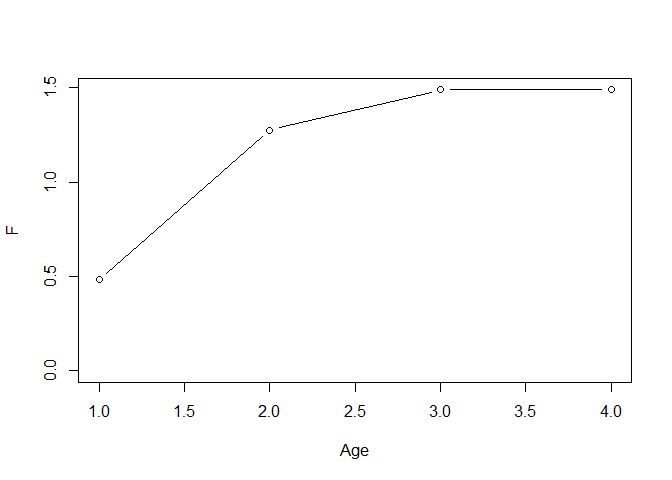
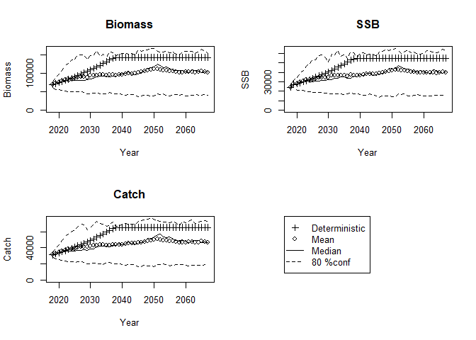
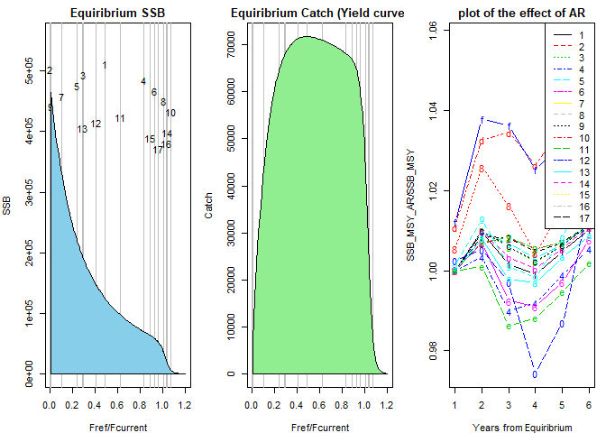
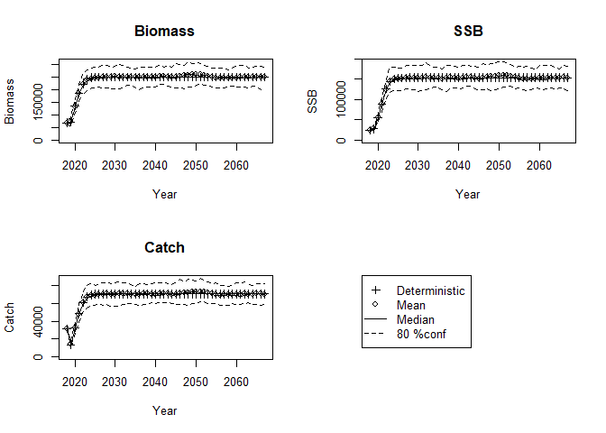

MSY推定用のRコード（ダイジェスト版）
================
Momoko Ichinokawa
2019-04-04

本マニュアルの完全版(細かいオプションの説明などがあります)はこちら <https://ichimomo.github.io/future-rvpa/future-doc-abc.html>

事前準備
========

データの読み込み
----------------

``` r
# 関数の読み込み →  warningまたは「警告」が出るかもしれませんが，その後動いていれば問題ありません
source("../../rvpa1.9.2.r")
source("../../future2.1.r")
source("../../utilities.r",encoding="UTF-8") # ggplotを使ったグラフ作成用の関数

# ライブラリの読み込み
library(tidyverse) # うまくインストールできない場合、最新のRを使ってください

# データの読み込み
caa <- read.csv("caa_pma.csv",row.names=1)
waa <- read.csv("waa_pma.csv",row.names=1)
maa <- read.csv("maa_pma.csv",row.names=1)
dat <- data.handler(caa=caa, waa=waa, maa=maa, M=0.5)
names(dat)
```

    [1] "caa"        "maa"        "waa"        "index"      "M"         
    [6] "maa.tune"   "waa.catch"  "catch.prop"

VPAによる資源量推定
-------------------

-   **設定ポイント:** vpa関数の引数fc.yearで指定した年数が今後current FのFとして扱われます。

-   [VPA結果を外部から読み込む場合](https://ichimomo.github.io/future-rvpa/future-doc-abc.html#vpa%E7%B5%90%E6%9E%9C%E3%82%92%E5%A4%96%E9%83%A8%E3%81%8B%E3%82%89%E8%AA%AD%E3%81%BF%E8%BE%BC%E3%82%80%E5%A0%B4%E5%90%88)
-   [再生産関係を仮定しない管理基準値の計算](https://ichimomo.github.io/future-rvpa/future-doc-abc.html#%E5%86%8D%E7%94%9F%E7%94%A3%E9%96%A2%E4%BF%82%E3%82%92%E4%BB%AE%E5%AE%9A%E3%81%97%E3%81%AA%E3%81%84%E7%AE%A1%E7%90%86%E5%9F%BA%E6%BA%96%E5%80%A4%E3%81%AE%E8%A8%88%E7%AE%97)

``` r
# VPAによる資源量推定
res.pma <- vpa(dat,fc.year=2015:2017,
               tf.year = 2008:2010,
               term.F="max",stat.tf="mean",Pope=TRUE,
               tune=FALSE,p.init=1.0)
```

``` r
res.pma$Fc.at.age # 将来予測やMSY計算で使うcurrent Fを確認してプロットする
```

            0         1         2         3 
    0.4838556 1.2749150 1.4877701 1.4877698 

``` r
plot(res.pma$Fc.at.age,type="b",xlab="Age",ylab="F",ylim=c(0,max(res.pma$Fc.at.age)))
```



``` r
# 独自のFc.at.ageを使いたい場合は以下のようにここで指定する
# res.pma$Fc.at.age[] <- c(1,1,2,2)
```

再生産関係の推定
----------------

-   詳しい解説は[こちら](https://ichimomo.github.io/future-rvpa/future-doc-abc.html#%E5%86%8D%E7%94%9F%E7%94%A3%E9%96%A2%E4%BF%82%E3%81%AE%E6%8E%A8%E5%AE%9A)
-   上記を参考に、AICで比較したあと、フィットした再生産関係のプロットなどをみて、ちゃんと推定できてそうか確かめて下さい
-   [モデル診断](https://ichimomo.github.io/future-rvpa/SRR-guidline.html)も行って下さい。
-   **設定ポイント:** get.SRdata関数のyearsの引数で、再生産関係をフィットさせたい年を指定します。何も指定しないと全年のデータが使われます。
-   **設定ポイント:** ここで、将来予測で使う再生産関係を一つに決めます(SRmodel.baseに入れる)。

``` r
# VPA結果を使って再生産データを作る
SRdata <- get.SRdata(res.pma, years=1988:2016) 
head(SRdata)
```

    $year
     [1] 1988 1989 1990 1991 1992 1993 1994 1995 1996 1997 1998 1999 2000 2001
    [15] 2002 2003 2004 2005 2006 2007 2008 2009 2010 2011 2012 2013 2014 2015
    [29] 2016

    $SSB
     [1] 12199.02 15266.68 15072.03 19114.22 23544.42 28769.36 34764.44
     [8] 38219.49 48535.10 61891.08 63966.56 38839.78 53404.29 47322.39
    [15] 54485.00 54385.04 47917.14 46090.76 59847.97 53370.62 48781.20
    [22] 42719.39 40095.19 39311.04 38332.44 37547.09 27543.26 22881.37
    [29] 22184.28

    $R
     [1]  406.0086  498.9652  544.3007  469.6025 1106.8877 1043.4237  696.7049
     [8]  923.9567 1353.1790 1698.8457 1117.5454 2381.1352 1669.1381 1818.3638
    [15] 1858.0043 1458.9524 1334.9288 1116.9433 1100.4598 1693.9768 1090.7172
    [22] 1081.8343 1265.0456 1023.9650  753.1901  764.0987  876.6335  500.9416
    [29]  549.3746

``` r
## モデルのフィット(網羅的に試しています)
# 網羅的なパラメータ設定
SRmodel.list <- expand.grid(SR.rel = c("HS","BH","RI"), AR.type = c(0, 1), L.type = c("L1", "L2"))
SR.list <- list()
for (i in 1:nrow(SRmodel.list)) {
    SR.list[[i]] <- fit.SR(SRdata, SR = SRmodel.list$SR.rel[i], method = SRmodel.list$L.type[i], 
        AR = SRmodel.list$AR.type[i], hessian = FALSE)
}

SRmodel.list$AICc <- sapply(SR.list, function(x) x$AICc)
SRmodel.list$delta.AIC <- SRmodel.list$AICc - min(SRmodel.list$AICc)
SR.list <- SR.list[order(SRmodel.list$AICc)]  # AICの小さい順に並べたもの
(SRmodel.list <- SRmodel.list[order(SRmodel.list$AICc), ]) # 結果
```

       SR.rel AR.type L.type     AICc delta.AIC
    7      HS       0     L2 11.68088 0.0000000
    9      RI       0     L2 12.30980 0.6289293
    8      BH       0     L2 12.35364 0.6727687
    2      BH       0     L1 13.79426 2.1133843
    3      RI       0     L1 13.87867 2.1977984
    5      BH       1     L1 14.09788 2.4170057
    6      RI       1     L1 14.10137 2.4204994
    10     HS       1     L2 14.32407 2.6431965
    1      HS       0     L1 14.75174 3.0708666
    12     RI       1     L2 14.99619 3.3153125
    11     BH       1     L2 15.05006 3.3691864
    4      HS       1     L1 15.68126 4.0003803

``` r
SRmodel.base <- SR.list[[1]] # AIC最小モデルを今後使っていく
```

将来予測
--------

-   細かい設定の解説は[こちら](https://ichimomo.github.io/future-rvpa/future-doc-abc.html#%E5%B0%86%E6%9D%A5%E4%BA%88%E6%B8%AC)
    -   自己相関を考慮する場合
    -   Frecオプション（目標の年に指定した確率で漁獲する）
    -   年齢別体重が資源尾数に影響される場合、などのオプションがあります
-   **設定ポイント:**　将来予測やMSY推定で使う生物パラメータをここで指定します（`waa.year`, `maa.year`, `M.year`）。ABC計算年（`ABC.year`）などの設定もここで。
-   **設定ポイント:**　再生産関係の関数型とパラメータも与えます。`rec.fun`に関数名を、`rec.arg`にリスト形式で引数を与えます。
-   これはFcurrentでの将来予測を実施しますが、今後の管理基準値計算でもここで指定したオプションを引き継いで使っていきます
-   近年の加入の仮定(`rec.new`)や近年の漁獲量(`pre.catch`)を設定する場合にはここで設定してください
-   引数 `silent == TRUE` とすると、設定した引数のリストがすべて表示されます。意図しない設定などがないかどうか確認してください。

``` r
future.Fcurrent <- future.vpa(res.pma,
                      multi=1,
                      nyear=50, # 将来予測の年数
                      start.year=2018, # 将来予測の開始年
                      N=100, # 確率的計算の繰り返し回数=>実際の計算では1000~5000回くらいやってください
                      ABC.year=2019, # ABCを計算する年
                      waa.year=2015:2017, # 生物パラメータの参照年
                      maa.year=2015:2017,
                      M.year=2015:2017,
                      is.plot=TRUE, # 結果をプロットするかどうか
                      seed=1,
                      silent=FALSE,
                      recfunc=HS.recAR, # 再生産関係の関数
                      # recfuncに対する引数
                      rec.arg=list(a=SRmodel.base$pars$a,b=SRmodel.base$pars$b,
                                   rho=SRmodel.base$pars$rho, # ここではrho=0なので指定しなくてもOK
                                   sd=SRmodel.base$pars$sd,resid=SRmodel.base$resid))
```

    $ABC.year
    [1] 2019

    $add.year
    [1] 0

    $Blim
    [1] 0

    $currentF
    NULL

    $delta
    NULL

    $det.run
    [1] TRUE

    $eaa0
    NULL

    $F.sigma
    [1] 0

    $faa0
    NULL

    $Frec
    NULL

    $HCR
    NULL

    $is.plot
    [1] TRUE

    $M
    NULL

    $M.year
    [1] 2015 2016 2017

    $maa
    NULL

    $maa.year
    [1] 2015 2016 2017

    $multi
    [1] 1

    $multi.year
    [1] 1

    $N
    [1] 100

    $naa0
    NULL

    $nyear
    [1] 50

    $outtype
    [1] "FULL"

    $plus.group
    [1] TRUE

    $Pope
    [1] TRUE

    $pre.catch
    NULL

    $random.select
    NULL

    $rec.arg
    $rec.arg$a
    [1] 0.02864499

    $rec.arg$b
    [1] 51882.06

    $rec.arg$rho
    [1] 0

    $rec.arg$sd
    [1] 0.2624895

    $rec.arg$resid
     [1]  0.15003999  0.13188525  0.23168312 -0.15352429  0.49544035
     [6]  0.23597319 -0.35721137 -0.16965875 -0.02705374  0.13375295
    [11] -0.28506140  0.76090931  0.11611132  0.29373043  0.22330688
    [16] -0.01847747 -0.02781840 -0.16723995 -0.30046800  0.13088282
    [21] -0.24773256 -0.12321799  0.09662881 -0.09504603 -0.37695727
    [26] -0.34187713  0.10535290 -0.26881174 -0.14558152


    $rec.new
    NULL

    $recfunc
    function (ssb, vpares, rec.resample = NULL, rec.arg = list(a = 1000, 
        b = 1000, sd = 0.1, rho = 0, resid = 0)) 
    {
        rec0 <- ifelse(ssb > rec.arg$b, rec.arg$a * rec.arg$b, rec.arg$a * 
            ssb)
        rec <- rec0 * exp(rec.arg$rho * rec.arg$resid)
        rec <- rec * exp(rnorm(length(ssb), -0.5 * rec.arg$sd2^2, 
            rec.arg$sd))
        new.resid <- log(rec/rec0) + 0.5 * rec.arg$sd2^2
        return(list(rec = rec, rec.resample = new.resid))
    }

    $replace.rec.year
    [1] 2012

    $seed
    [1] 1

    $silent
    [1] FALSE

    $start.year
    [1] 2018

    $use.MSE
    [1] FALSE

    $waa
    NULL

    $waa.catch
    NULL

    $waa.fun
    [1] FALSE

    $waa.year
    [1] 2015 2016 2017



MSY管理基準値の計算
-------------------

-   MSY管理基準値計算では，上記の将来予測において，Fcurrentの値に様々な乗数を乗じたF一定方策における平衡状態時の（世代時間×20年を`nyear`で指定します）資源量やそれに対応するF等を管理基準値として算出します
-   なので、ここまでのプロセスで、ABC計算のためにきちんとしたオプションを設定したfuture.vpaを実行しておいてください。その返り値`future.Fcurrent`をMSY計算では使っていきます
-   MSY.est関数の引数の詳細な解説は[こちら](https://ichimomo.github.io/future-rvpa/future-doc-abc.html#msy%E7%AE%A1%E7%90%86%E5%9F%BA%E6%BA%96%E5%80%A4%E3%81%AE%E8%A8%88%E7%AE%97)
-   オプション`PGY`(MSYに対する比率を指定) や`B0percent`(B0に対する比率を指定)、`Bempirical`(親魚資源量の絶対値で指定)で、別の管理基準値も同時に計算できます。
-   最近年の親魚量で維持した場合の管理基準値も、比較のためにあとで見るため`Bempirical`で指定しておいてください。また、B\_HS(HSの折れ点)や最大親魚量などもここで計算しておいても良いかと。。。

``` r
# MSY管理基準値の計算
MSY.base <- est.MSY(res.pma, # VPAの計算結果
                 future.Fcurrent$input, # 将来予測で使用した引数
                 resid.year=0, # ARありの場合、最近何年分の残差を平均するかをここで指定する。ARありの設定を反映させたい場合必ずここを１以上とすること（とりあえず１としておいてください）。
                 N=100, # 確率的計算の繰り返し回数=>実際の計算では1000~5000回くらいやってください
                 calc.yieldcurve=TRUE,
                 PGY=c(0.95,0.9,0.6,0.1), # 計算したいPGYレベル。上限と下限の両方が計算される
                 onlylower.pgy=FALSE, # TRUEにするとPGYレベルの上限は計算しない（計算時間の節約になる）
                 B0percent=c(0.2,0.3,0.4),
                 Bempirical=c(round(tail(colSums(res.pma$ssb),n=1)),
                              round(max(colSums(res.pma$ssb))),
                              24000, # 現行Blimit
                              SRmodel.base$pars$b) # HSの折れ点
                 ) # 計算したいB0%レベル
```

    Estimating MSY
    F multiplier= 0.4903466 
    Estimating PGY  95 %
    F multiplier= 0.3006464 
    F multiplier= 0.8322266 
    Estimating PGY  90 %
    F multiplier= 0.2442106 
    F multiplier= 0.9314554 
    Estimating PGY  60 %
    F multiplier= 0.1042389 
    F multiplier= 1.009078 
    Estimating PGY  10 %
    F multiplier= 0.01208144 
    F multiplier= 1.076094 
    Estimating B0  20 %
    F multiplier= 0.622057 
    Estimating B0  30 %
    F multiplier= 0.4132039 
    Estimating B0  40 %
    F multiplier= 0.289628 
    Estimating B empirical  19431 
    F multiplier= 1.037682 
    Estimating B empirical  63967 
    F multiplier= 0.8873748 
    Estimating B empirical  24000 
    F multiplier= 1.029399 
    Estimating B empirical  51882.06 
    F multiplier= 0.9647514 



### 結果の表示

-   `MSY.base$summary_tb`にすべての結果が入っています。

``` r
# 結果の表示(tibbleという形式で表示され、最初の10行以外は省略されます)
options(tibble.width = Inf)
(refs.all <- MSY.base$summary_tb)
```

    # A tibble: 34 x 15
       RP_name        AR        SSB SSB2SSB0       B      U  Catch Catch.CV
       <chr>          <lgl>   <dbl>    <dbl>   <dbl>  <dbl>  <dbl>    <dbl>
     1 MSY            FALSE 124683.   0.256  220603. 0.325  71794.   0.141 
     2 B0             FALSE 487727.   1      593470. 0          0  NaN     
     3 PGY_0.95_upper FALSE 189807.   0.389  289254. 0.236  68205.   0.128 
     4 PGY_0.95_lower FALSE  69681.   0.143  159681. 0.427  68205.   0.161 
     5 PGY_0.9_upper  FALSE 219414.   0.450  319974. 0.202  64615.   0.123 
     6 PGY_0.9_lower  FALSE  58475.   0.120  144431. 0.447  64615.   0.185 
     7 PGY_0.6_upper  FALSE 332383.   0.681  435838. 0.0988 43080.   0.109 
     8 PGY_0.6_lower  FALSE  35490.   0.0728  93729. 0.460  43074.   0.463 
     9 PGY_0.1_upper  FALSE 464461.   0.952  569933. 0.0126  7172.   0.0987
    10 PGY_0.1_lower  FALSE   5564.   0.0114  15180. 0.473   7175.   1.41  
       `Fref/Fcur` Fref2Fcurrent      F0     F1     F2     F3 RP.definition
             <dbl>         <dbl>   <dbl>  <dbl>  <dbl>  <dbl> <chr>        
     1      0.490         0.490  0.237   0.625  0.730  0.730  Btarget0     
     2      0             0      0       0      0      0      <NA>         
     3      0.301         0.301  0.145   0.383  0.447  0.447  <NA>         
     4      0.832         0.832  0.403   1.06   1.24   1.24   <NA>         
     5      0.244         0.244  0.118   0.311  0.363  0.363  <NA>         
     6      0.931         0.931  0.451   1.19   1.39   1.39   Blow0        
     7      0.104         0.104  0.0504  0.133  0.155  0.155  <NA>         
     8      1.01          1.01   0.488   1.29   1.50   1.50   Blimit0      
     9      0.0121        0.0121 0.00585 0.0154 0.0180 0.0180 <NA>         
    10      1.08          1.08   0.521   1.37   1.60   1.60   Bban0        
    # ... with 24 more rows

``` r
# 全データをじっくり見たい場合
# View(refs.all)
```

### 管理基準値の選択

-   **設定ポイント** est.MSYで計算された管理基準値から、何をBtarget, Blimit, Bbanとして用いるかをチョイスします。
-   具体的には、refs.allにRP.definitionという新しい列をひとつ作って、その列にそれぞれの管理基準値をどのように使うかを指定します
-   「管理基準値名 + 0」はデフォルト規則による管理基準値
-   デフォルトでは、ARなし、MSY="Btarget0", 0.9MSY="Blow0",0.6MSY="Blimit0", 0.1MSY="Bban0"になるようになっています
-   代替候補がある場合は「管理基準値名 + 数字」として指定
-   たとえば目標管理基準値の第一候補はBmsyなのでRP\_nameがMSYでARなしの行のRP.definitionには"Btarget0"と入力します
-   Rコードがちょっと汚いですがご容赦ください。いい方法あったら教えてください。

``` r
# どの管理基準値をどのように定義するか。デフォルトから外れる場合はここで定義する
refs.all$RP.definition[refs.all$RP_name=="B0-20%" & refs.all$AR==FALSE] <- "Btarget1"  # たとえばBtargetの代替値としてB020%も候補に残しておきたい場合
refs.all$RP.definition[refs.all$RP_name=="PGY_0.95_lower" & refs.all$AR==FALSE] <- "Btarget2" 
refs.all$RP.definition[refs.all$RP_name=="Ben-19431" & refs.all$AR==FALSE] <- "Bcurrent"
refs.all$RP.definition[refs.all$RP_name=="Ben-63967" & refs.all$AR==FALSE] <- "Bmax"
refs.all$RP.definition[refs.all$RP_name=="Ben-24000" & refs.all$AR==FALSE] <- "Blimit1"
refs.all$RP.definition[refs.all$RP_name=="Ben-51882" & refs.all$AR==FALSE] <- "B_HS"

# 定義した結果を見る
refs.all %>% select(RP_name,RP.definition)
```

    # A tibble: 34 x 2
       RP_name        RP.definition
       <chr>          <chr>        
     1 MSY            Btarget0     
     2 B0             <NA>         
     3 PGY_0.95_upper <NA>         
     4 PGY_0.95_lower Btarget2     
     5 PGY_0.9_upper  <NA>         
     6 PGY_0.9_lower  Blow0        
     7 PGY_0.6_upper  <NA>         
     8 PGY_0.6_lower  Blimit0      
     9 PGY_0.1_upper  <NA>         
    10 PGY_0.1_lower  Bban0        
    # ... with 24 more rows

``` r
# refs.allの中からRP.definitionで指定された行だけを抜き出す
(refs.base <- refs.all %>%
    dplyr::filter(!is.na(RP.definition)) %>% # RP.definitionがNAでないものを抽出
    arrange(desc(SSB)) %>% # SSBを大きい順に並び替え
    select(RP.definition,RP_name,SSB,SSB2SSB0,Catch,Catch.CV,U,Fref2Fcurrent)) #　列を並び替え
```

    # A tibble: 10 x 8
       RP.definition RP_name            SSB SSB2SSB0  Catch Catch.CV     U
       <chr>         <chr>            <dbl>    <dbl>  <dbl>    <dbl> <dbl>
     1 Btarget0      MSY            124683.   0.256  71794.    0.141 0.325
     2 Btarget1      B0-20%          97546.   0.200  71023.    0.149 0.371
     3 Btarget2      PGY_0.95_lower  69681.   0.143  68205.    0.161 0.427
     4 Bmax          Ben-63967       63971.   0.131  66913.    0.170 0.439
     5 Blow0         PGY_0.9_lower   58475.   0.120  64615.    0.185 0.447
     6 B_HS          Ben-51882       51882.   0.106  59717.    0.239 0.453
     7 Blimit0       PGY_0.6_lower   35490.   0.0728 43074.    0.463 0.460
     8 Blimit1       Ben-24000       24006.   0.0492 29863.    0.658 0.462
     9 Bcurrent      Ben-19431       19440.   0.0399 24340.    0.761 0.464
    10 Bban0         PGY_0.1_lower    5564.   0.0114  7175.    1.41  0.473
       Fref2Fcurrent
               <dbl>
     1         0.490
     2         0.622
     3         0.832
     4         0.887
     5         0.931
     6         0.965
     7         1.01 
     8         1.03 
     9         1.04 
    10         1.08 

### デフォルトルールを使った将来予測

``` r
# デフォルトのHCRはBtarget0,Blimit0,Bban0のセットになるので、それを使って将来予測する
input.abc <- future.Fcurrent$input # Fcurrentにおける将来予測の引数をベースに将来予測します
input.abc$multi <- derive_RP_value(refs.base,"Btarget0")$Fref2Fcurrent # currentFへの乗数を"Btarget0"で指定した値に
input.abc$HCR <- list(Blim=derive_RP_value(refs.base,"Blimit0")$SSB,
                      Bban=derive_RP_value(refs.base,"Bban0")$SSB,
                      beta=0.8,year.lag=0) # BlimitはBlimit0, BbanはBban0の値
future.default <- do.call(future.vpa,input.abc) # デフォルトルールの結果→図示などに使う
```

    $ABC.year
    [1] 2019

    $add.year
    [1] 0

    $Blim
    [1] 0

    $currentF
    NULL

    $delta
    NULL

    $det.run
    [1] TRUE

    $eaa0
    NULL

    $F.sigma
    [1] 0

    $faa0
    NULL

    $Frec
    NULL

    $HCR
    $HCR$Blim
    [1] 35489.95

    $HCR$Bban
    [1] 5564.275

    $HCR$beta
    [1] 0.8

    $HCR$year.lag
    [1] 0


    $is.plot
    [1] TRUE

    $M
    NULL

    $M.year
    [1] 2015 2016 2017

    $maa
    NULL

    $maa.year
    [1] 2015 2016 2017

    $multi
    [1] 0.4903466

    $multi.year
    [1] 1

    $N
    [1] 100

    $naa0
    NULL

    $nyear
    [1] 50

    $outtype
    [1] "FULL"

    $plus.group
    [1] TRUE

    $Pope
    [1] TRUE

    $pre.catch
    NULL

    $random.select
    NULL

    $rec.arg
    $rec.arg$a
    [1] 0.02864499

    $rec.arg$b
    [1] 51882.06

    $rec.arg$rho
    [1] 0

    $rec.arg$sd
    [1] 0.2624895

    $rec.arg$resid
     [1]  0.15003999  0.13188525  0.23168312 -0.15352429  0.49544035
     [6]  0.23597319 -0.35721137 -0.16965875 -0.02705374  0.13375295
    [11] -0.28506140  0.76090931  0.11611132  0.29373043  0.22330688
    [16] -0.01847747 -0.02781840 -0.16723995 -0.30046800  0.13088282
    [21] -0.24773256 -0.12321799  0.09662881 -0.09504603 -0.37695727
    [26] -0.34187713  0.10535290 -0.26881174 -0.14558152


    $rec.new
    NULL

    $recfunc
    function (ssb, vpares, rec.resample = NULL, rec.arg = list(a = 1000, 
        b = 1000, sd = 0.1, rho = 0, resid = 0)) 
    {
        rec0 <- ifelse(ssb > rec.arg$b, rec.arg$a * rec.arg$b, rec.arg$a * 
            ssb)
        rec <- rec0 * exp(rec.arg$rho * rec.arg$resid)
        rec <- rec * exp(rnorm(length(ssb), -0.5 * rec.arg$sd2^2, 
            rec.arg$sd))
        new.resid <- log(rec/rec0) + 0.5 * rec.arg$sd2^2
        return(list(rec = rec, rec.resample = new.resid))
    }
    <bytecode: 0x000000001c3a7670>

    $replace.rec.year
    [1] 2012

    $seed
    [1] 1

    $silent
    [1] FALSE

    $start.year
    [1] 2018

    $use.MSE
    [1] FALSE

    $waa
    NULL

    $waa.catch
    NULL

    $waa.fun
    [1] FALSE

    $waa.year
    [1] 2015 2016 2017



``` r
## 網羅的将来予測の実施
# default
kobeII.table <- calc_kobeII_matrix(future.Fcurrent,
                         refs.base,
                         Btarget=c("Btarget0","Btarget1"), # HCRの候補として選択したい管理基準値を入れる
                         Blimit=c("Blimit0","Blimit1"),
                         beta=seq(from=0.5,to=1,by=0.1)) # betaの区分
```

    4 HCR is calculated:  Btarget0-Blimit0-Bban0 Btarget0-Blimit1-Bban0 Btarget1-Blimit0-Bban0 Btarget1-Blimit1-Bban0 

``` r
# 例えば2017~2023,28,38年の漁獲量の表を作成する
(catch.table <- kobeII.table %>%
    dplyr::filter(year%in%c(2017:2023,2028,2038),stat=="catch") %>% # 取り出す年とラベル("catch")を選ぶ
    group_by(HCR_name,beta,year) %>%
    summarise(catch.mean=round(mean(value),-3)) %>%  # 値の計算方法を指定（漁獲量の平均ならmean(value)）
                                                     # "-3"とかの値で桁数を指定
    spread(key=year,value=catch.mean) %>% ungroup() %>%
    arrange(HCR_name,desc(beta)) %>% # HCR_nameとbetaの順に並び替え
    mutate(stat_name="catch.mean"))
```

    # A tibble: 24 x 11
       HCR_name                beta `2018` `2019` `2020` `2021` `2022` `2023`
       <chr>                  <dbl>  <dbl>  <dbl>  <dbl>  <dbl>  <dbl>  <dbl>
     1 Btarget0-Blimit0-Bban0   1    31000  16000  36000  52000  63000  69000
     2 Btarget0-Blimit0-Bban0   0.9  31000  15000  34000  50000  62000  69000
     3 Btarget0-Blimit0-Bban0   0.8  31000  14000  32000  48000  61000  68000
     4 Btarget0-Blimit0-Bban0   0.7  31000  12000  30000  46000  59000  66000
     5 Btarget0-Blimit0-Bban0   0.6  31000  11000  27000  42000  56000  63000
     6 Btarget0-Blimit0-Bban0   0.5  31000   9000  24000  38000  51000  59000
     7 Btarget0-Blimit1-Bban0   1    31000  20000  33000  48000  61000  68000
     8 Btarget0-Blimit1-Bban0   0.9  31000  19000  31000  47000  60000  67000
     9 Btarget0-Blimit1-Bban0   0.8  31000  17000  30000  46000  59000  67000
    10 Btarget0-Blimit1-Bban0   0.7  31000  15000  28000  44000  57000  65000
       `2028` `2038` stat_name 
        <dbl>  <dbl> <chr>     
     1  72000  71000 catch.mean
     2  72000  71000 catch.mean
     3  71000  71000 catch.mean
     4  70000  70000 catch.mean
     5  68000  68000 catch.mean
     6  65000  65000 catch.mean
     7  72000  71000 catch.mean
     8  72000  71000 catch.mean
     9  71000  71000 catch.mean
    10  70000  70000 catch.mean
    # ... with 14 more rows

``` r
# 1-currentFに乗じる値=currentFからの努力量の削減率の平均値（実際には確率分布になっている）
(Fsakugen.table <- kobeII.table %>%
    dplyr::filter(year%in%c(2017:2023,2028,2038),stat=="Fsakugen") %>% # 取り出す年とラベル("catch")を選ぶ
    group_by(HCR_name,beta,year) %>%
    summarise(Fsakugen=round(mean(value),2)) %>%
    spread(key=year,value=Fsakugen) %>% ungroup() %>%
    arrange(HCR_name,desc(beta)) %>% # HCR_nameとbetaの順に並び替え
    mutate(stat_name="Fsakugen"))
```

    # A tibble: 24 x 11
       HCR_name                beta `2018` `2019` `2020` `2021` `2022` `2023`
       <chr>                  <dbl>  <dbl>  <dbl>  <dbl>  <dbl>  <dbl>  <dbl>
     1 Btarget0-Blimit0-Bban0   1        0  -0.64  -0.51  -0.51  -0.51  -0.51
     2 Btarget0-Blimit0-Bban0   0.9      0  -0.68  -0.56  -0.56  -0.56  -0.56
     3 Btarget0-Blimit0-Bban0   0.8      0  -0.71  -0.61  -0.61  -0.61  -0.61
     4 Btarget0-Blimit0-Bban0   0.7      0  -0.75  -0.66  -0.66  -0.66  -0.66
     5 Btarget0-Blimit0-Bban0   0.6      0  -0.78  -0.71  -0.71  -0.71  -0.71
     6 Btarget0-Blimit0-Bban0   0.5      0  -0.82  -0.75  -0.75  -0.75  -0.75
     7 Btarget0-Blimit1-Bban0   1        0  -0.51  -0.51  -0.51  -0.51  -0.51
     8 Btarget0-Blimit1-Bban0   0.9      0  -0.56  -0.56  -0.56  -0.56  -0.56
     9 Btarget0-Blimit1-Bban0   0.8      0  -0.61  -0.61  -0.61  -0.61  -0.61
    10 Btarget0-Blimit1-Bban0   0.7      0  -0.66  -0.66  -0.66  -0.66  -0.66
       `2028` `2038` stat_name
        <dbl>  <dbl> <chr>    
     1  -0.51  -0.51 Fsakugen 
     2  -0.56  -0.56 Fsakugen 
     3  -0.61  -0.61 Fsakugen 
     4  -0.66  -0.66 Fsakugen 
     5  -0.71  -0.71 Fsakugen 
     6  -0.75  -0.75 Fsakugen 
     7  -0.51  -0.51 Fsakugen 
     8  -0.56  -0.56 Fsakugen 
     9  -0.61  -0.61 Fsakugen 
    10  -0.66  -0.66 Fsakugen 
    # ... with 14 more rows

``` r
# SSB>SSBtargetとなる確率
ssbtarget.table <- kobeII.table %>%
    dplyr::filter(year%in%c(2017:2023,2028,2038),stat=="SSB") %>%
    group_by(HCR_name,beta,year) %>%
    summarise(ssb.over.target=round(100*mean(value>Btarget))) %>%
    spread(key=year,value=ssb.over.target) %>%
    ungroup() %>%
    arrange(HCR_name,desc(beta))%>%
    mutate(stat_name="Pr(SSB>SSBtarget)")

# SSB>SSBlow(=高位水準)となる確率
ssblow.table <- kobeII.table %>%
    dplyr::filter(year%in%c(2017:2023,2028,2038),stat=="SSB") %>%
    group_by(HCR_name,beta,year) %>%
    summarise(ssb.over.target=round(100*mean(value>Blow))) %>%
    spread(key=year,value=ssb.over.target)%>%
    ungroup() %>%
    arrange(HCR_name,desc(beta))%>%
    mutate(stat_name="Pr(SSB>SSBlow)")

# SSB>SSBlimとなる確率
ssblimit.table <- kobeII.table %>%
    dplyr::filter(year%in%c(2017:2023,2028,2038),stat=="SSB") %>%
    group_by(HCR_name,beta,year) %>%
    summarise(ssb.over.target=round(100*mean(value>Blimit))) %>%
    spread(key=year,value=ssb.over.target)%>%
    ungroup() %>%
    arrange(HCR_name,desc(beta))%>%
    mutate(stat_name="Pr(SSB>SSBlim)")

# SSB>SSBmin(過去最低親魚量を上回る確率)
ssb.min <- min(unlist(colSums(res.pma$ssb)))
ssbmin.table <- kobeII.table %>%
    dplyr::filter(year%in%c(2017:2023,2028,2038),stat=="SSB") %>%
    group_by(HCR_name,beta,year) %>%
    summarise(ssb.over.target=round(100*mean(value>ssb.min))) %>%
    spread(key=year,value=ssb.over.target)%>%
    ungroup() %>%
    arrange(HCR_name,desc(beta))%>%
    mutate(stat_name="Pr(SSB>SSBlim)")


# オプション: Catch AAV mean 
calc.aav <- function(x)sum(abs(diff(x)))/sum(x[-1])
catch.aav.table <- kobeII.table %>%
    dplyr::filter(year%in%c(2017:2023),stat=="catch") %>%
    group_by(HCR_name,beta,sim) %>%
    dplyr::summarise(catch.aav=(calc.aav(value))) %>%
    group_by(HCR_name,beta) %>%
    summarise(catch.aav.mean=mean(catch.aav)) %>%
    arrange(HCR_name,desc(beta))%>%
    mutate(stat_name="catch.csv (recent 5 year)")


## csvファイルに一括して出力する場合
all.table <- bind_rows(catch.table,
                       ssbtarget.table,
                       ssblow.table,
                       ssblimit.table,
                       ssbmin.table)
write.csv(all.table,file="all.table.csv")
```
