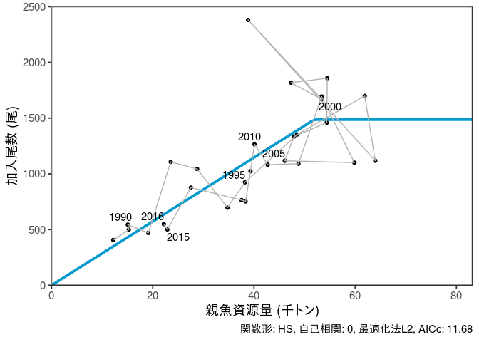
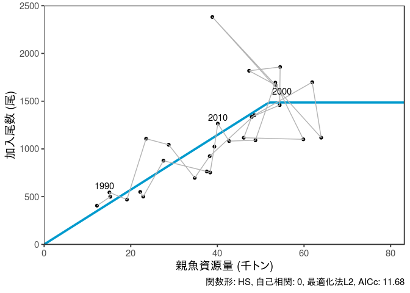
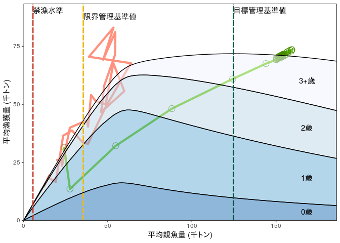
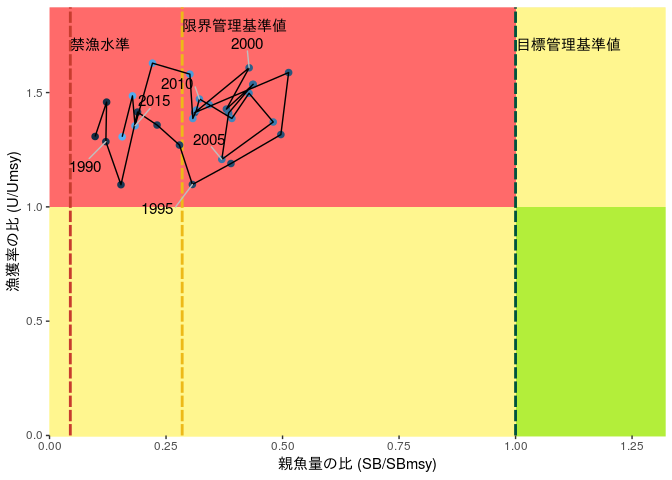
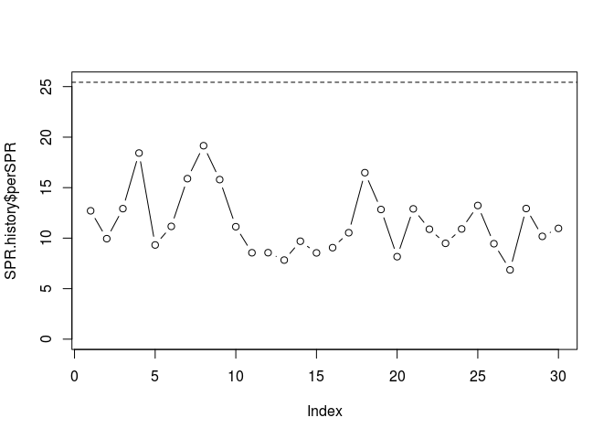
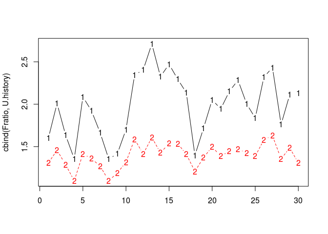
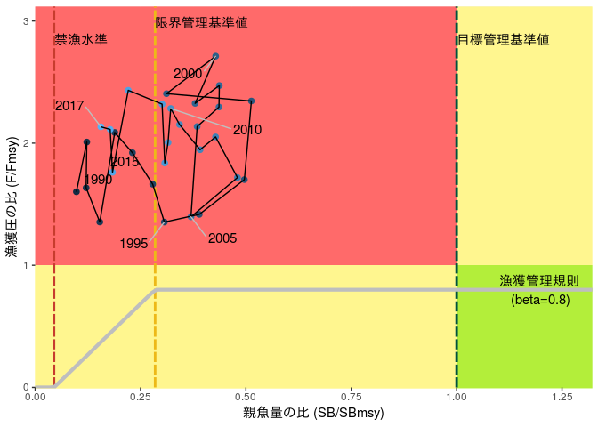

会議用資料
================
2019-04-23

SH会議用の出力
==============

``` r
source("../../rvpa1.9.2.r")
source("../../future2.1.r")
source("../../utilities.r",encoding="UTF-8") # ggplotを使ったグラフ作成用の関数

options(scipen=100) # 桁数表示の調整(1E+9とかを抑制する)

library(tidyverse)
## 再生産関係のプロット(x,yの単位やスケールを入れて下さい)
(g1_SRplot <- SRplot_gg(SRmodel.base,xscale=1000,xlabel="千トン",yscale=1,ylabel="尾"))
```



``` r
(g1_SRplot <- SRplot_gg(SRmodel.base,xscale=1000,xlabel="千トン",yscale=1,ylabel="尾",
                        labeling.year=c(1990,2000,2010,2017))) # 何年のデータにラベルを入れるか指定もできる
```



``` r
ggsave("g1_SRplot.png",g1_SRplot,width=6,height=3,dpi=600)

## yield curve
refs.plot <- filter(refs.base,RP.definition%in%c("Btarget0","Blimit0","Bban0"))
(g2_yield_curve <- plot_yield(MSY.base$trace,
                              refs.plot,
                              refs.label=c("目標水準","限界水準","禁漁水準"),
                              future=list(future.default),
                              past=res.pma,
                              biomass.unit=1000,#資源量の単位
                              AR=FALSE,xlim.scale=0.4,ylim.scale=1.3))
```



``` r
ggsave("g2_yield_curve.png",g2_yield_curve,width=6,height=3,dpi=600)

## kobe plot
# プロットする管理基準値だけ取り出す
(g3_kobe4 <- plot_kobe_gg(res.pma,refs.base,roll_mean=1,category=4,
                   Blow="Btarget0", # Btargeと同じ値を入れておいてください
                   Btarget="Btarget0")) # <- どの管理基準値を軸に使うのか指定。指定しなければ"0"マークがついた管理基準値が使われます
```



``` r
ggsave("g3_kobe4-1.png",g3_kobe4,width=6,height=3,dpi=600)

# write.vline=FALSEで、縦の管理基準値の線を書かないようにもできます（水産庁からの要望？）
(g3_kobe4 <- plot_kobe_gg(res.pma,refs.base,roll_mean=3,category=4,
                          Blow="Btarget0",Btarget="Btarget0",write.vline=FALSE))
```



``` r
ggsave("g3_kobe4-2.png",g3_kobe4,width=6,height=3,dpi=600)

## 将来予測の図
# 親魚資源量と漁獲量の時系列の図示
(g5_future <- plot_futures(res.pma, #vpaの結果
                   list(future.Fcurrent,future.default), # 将来予測結果
                   future.name=c("F current",str_c("HCR(beta=",future.default$input$HCR$beta,")")),
                   CI_range=c(0.1,0.9),
                   maxyear=2045,
                   ncol=1, # 図の出力の列数。3行x1列ならncol=1
                   what.plot=c("biomass","SSB","catch"),
                   Btarget=derive_RP_value(refs.base,"Btarget0")$SSB,
                   Blimit=derive_RP_value(refs.base,"Blimit0")$SSB,
#                   Blow=derive_RP_value(refs.base,"Blow0")$SSB, blowのオプションは削除
                   Bban=derive_RP_value(refs.base,"Bban0")$SSB,
                   RP_name=c("目標水準","限界水準","禁漁水準"),
                   biomass.unit=1000,  # バイオマスの単位(100, 1000, or 10000トン)
                   n_example=5,seed=2, # どのシミュレーションをピックアップするかはseedの値を変えて調整してください
                   font.size=14)) # フォントサイズ
```



``` r
ggsave("g5_future.png",g5_future,width=9,height=11,dpi=600)

(g6_hcr <- plot_HCR(SBtarget=derive_RP_value(refs.base,"Btarget0")$SSB,
         SBlim=derive_RP_value(refs.base,"Blimit0")$SSB,
         SBban=derive_RP_value(refs.base,"Bban0")$SSB,
         Ftarget=1,biomass.unit=1000,
         beta=0.8))
```



``` r
ggsave("g6_hcr.png",g6_hcr,width=8,height=4,dpi=600)
```
