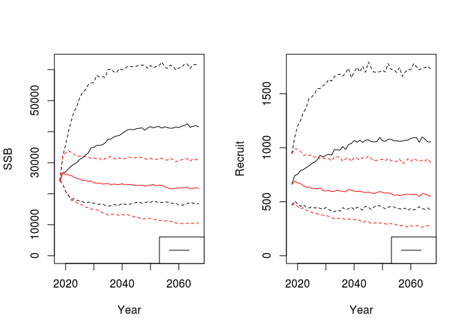
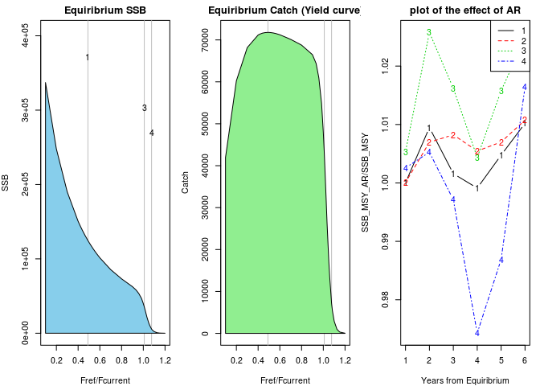
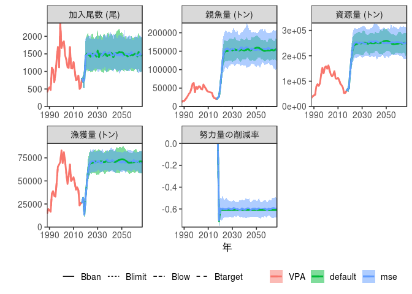
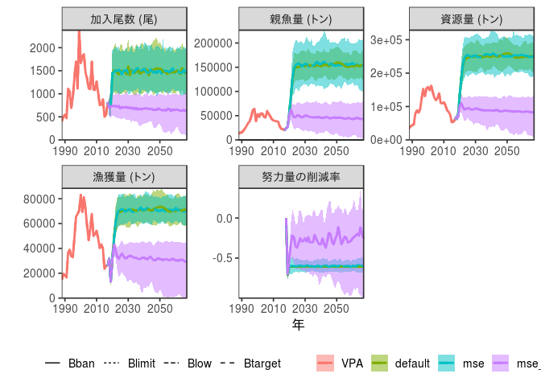
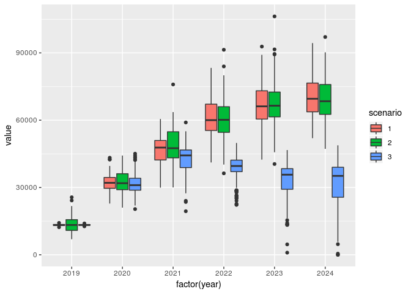

small MSE
================
Momoko Ichinokawa
2019-04-03

``` r
## Global options
library(rmarkdown)
library(knitr)
options(max.print="75")
opts_chunk$set(#echo=FALSE,
               prompt=FALSE,
               tidy=TRUE,
               comment=NA,
               message=FALSE,
               warning=FALSE)
```

future.rvpaで簡易MSE
====================

事前準備
--------

``` r
# 関数の読み込み →
# warningまたは「警告」が出るかもしれませんが，その後動いていれば問題ありません
source("../../rvpa1.9.2.r")
source("../../future2.1.r")
source("../../utilities.r", encoding = "UTF-8")  # ggplotを使ったグラフ作成用の関数
source("future-diff.r")
library(tidyverse)  # うまくインストールできない場合、最新のRを使ってください
caa <- read.csv("../make_report1/caa_pma.csv", row.names = 1)
waa <- read.csv("../make_report1/waa_pma.csv", row.names = 1)
maa <- read.csv("../make_report1/maa_pma.csv", row.names = 1)
dat <- data.handler(caa = caa, waa = waa, maa = maa, M = 0.5)
names(dat)
```

    [1] "caa"        "maa"        "waa"        "index"      "M"         
    [6] "maa.tune"   "waa.catch"  "catch.prop"

``` r
# VPAによる資源量推定
res.pma <- vpa(dat, fc.year = 2015:2017, tf.year = 2008:2010, term.F = "max", 
    stat.tf = "mean", Pope = TRUE, tune = FALSE, p.init = 1)
# VPA結果を使って再生産データを作る
SRdata <- get.SRdata(res.pma, years = 1988:2016)
```

再生産モデルのフィット
----------------------

``` r
# 網羅的なパラメータ設定
SRmodel.list <- expand.grid(SR.rel = c("HS", "BH", "RI"), AR.type = c(0, 1), 
    L.type = c("L1", "L2"))
SR.list <- list()
for (i in 1:nrow(SRmodel.list)) {
    SR.list[[i]] <- fit.SR(SRdata, SR = SRmodel.list$SR.rel[i], method = SRmodel.list$L.type[i], 
        AR = SRmodel.list$AR.type[i], hessian = FALSE)
}

SRmodel.list$AICc <- sapply(SR.list, function(x) x$AICc)
SRmodel.list$delta.AIC <- SRmodel.list$AICc - min(SRmodel.list$AICc)
SR.list <- SR.list[order(SRmodel.list$AICc)]  # AICの小さい順に並べたもの
(SRmodel.list <- SRmodel.list[order(SRmodel.list$AICc), ])  # 結果
```

       SR.rel AR.type L.type     AICc delta.AIC
    7      HS       0     L2 11.68088 0.0000000
    9      RI       0     L2 12.30980 0.6289293
    8      BH       0     L2 12.35364 0.6727687
    2      BH       0     L1 13.79426 2.1133843
    3      RI       0     L1 13.87867 2.1977984
    5      BH       1     L1 14.09788 2.4170057
    6      RI       1     L1 14.10137 2.4204994
    10     HS       1     L2 14.32407 2.6431965
    1      HS       0     L1 14.75174 3.0708666
    12     RI       1     L2 14.99619 3.3153125
    11     BH       1     L2 15.05006 3.3691864
    4      HS       1     L1 15.68126 4.0003803

``` r
SRmodel.base <- SR.list[[1]]  # AIC最小モデルを今後使っていく
```

将来予測の実施
--------------

``` r
future.Fcurrent <- future.vpa(res.pma,
                      multi=1,
                      nyear=50, # 将来予測の年数
                      start.year=2018, # 将来予測の開始年
                      N=1000, # 確率的計算の繰り返し回数=>実際の計算では1000~5000回くらいやってください
                      ABC.year=2019, # ABCを計算する年
                      waa.year=2015:2017, # 生物パラメータの参照年
                      maa.year=2015:2017,
                      M.year=2015:2017,
                      is.plot=FALSE, # 結果をプロットするかどうか
                      seed=1,
                      silent=TRUE,
                      recfunc=HS.recAR, # 再生産関係の関数
                      # recfuncに対する引数
                      rec.arg=list(a=SRmodel.base$pars$a,b=SRmodel.base$pars$b,
                                   rho=SRmodel.base$pars$rho, # ここではrho=0なので指定しなくてもOK
                                   sd=SRmodel.base$pars$sd,resid=SRmodel.base$resid))

# たとえば、bをbest modelの半分と仮定してみる
SRmodel.R1 <- SRmodel.base
SRmodel.R1$pars$b <- SRmodel.R1$pars$b/2
future.Fcurrent_R1 <- future.vpa(res.pma,
                      multi=1,
                      nyear=50, # 将来予測の年数
                      start.year=2018, # 将来予測の開始年
                      N=1000, # 確率的計算の繰り返し回数=>実際の計算では1000~5000回くらいやってください
                      ABC.year=2019, # ABCを計算する年
                      waa.year=2015:2017, # 生物パラメータの参照年
                      maa.year=2015:2017,
                      M.year=2015:2017,
                      is.plot=FALSE, # 結果をプロットするかどうか
                      seed=1,
                      silent=TRUE,
                      recfunc=HS.recAR, # 再生産関係の関数
                      # recfuncに対する引数
                      rec.arg=list(a=SRmodel.R1$pars$a,b=SRmodel.R1$pars$b,
                                   rho=SRmodel.R1$pars$rho, # ここではrho=0なので指定しなくてもOK
                                   sd=SRmodel.R1$pars$sd,resid=SRmodel.R1$resid))

par(mfrow=c(1,2))
plot.futures(list(future.Fcurrent,future.Fcurrent_R1))
plot.futures(list(future.Fcurrent,future.Fcurrent_R1),target="Recruit")
```



MSY管理基準値の計算;
--------------------

``` r
# MSYはbase caseのシナリオをもとにする
MSY.base <- est.MSY(res.pma, # VPAの計算結果
                 future.Fcurrent$input, # 将来予測で使用した引数
                 resid.year=0, 
                 N=100, # 確率的計算の繰り返し回数=>実際の計算では1000~5000回くらいやってください
                 calc.yieldcurve=TRUE,
                 PGY=c(0.6,0.1), # 計算したいPGYレベル。上限と下限の両方が計算される
                 onlylower.pgy=TRUE, # TRUEにするとPGYレベルの上限は計算しない（計算時間の節約になる）
                 B0percent=NULL,
                 Bempirical=NULL
                 ) 
```

    Estimating MSY
    F multiplier= 0.4903466 
    Estimating PGY  60 %
    F multiplier= 1.009095 
    Estimating PGY  10 %
    F multiplier= 1.076097 



``` r
refs.all <- MSY.base$summary_tb
refs.base <- refs.all %>%
    dplyr::filter(!is.na(RP.definition)) %>% # RP.definitionがNAでないものを抽出
    arrange(desc(SSB)) %>% # SSBを大きい順に並び替え
    select(RP.definition,RP_name,SSB,SSB2SSB0,Catch,Catch.CV,U,Fref2Fcurrent) #　列を並び替え
```

簡易MSEの実施
-------------

``` r
# 通常の将来予測（デフォルトHCR）
input.abc <- future.Fcurrent$input  # Fcurrentにおける将来予測の引数をベースに将来予測します
input.abc$multi <- derive_RP_value(refs.base, "Btarget0")$Fref2Fcurrent  # currentFへの乗数を'Btarget0'で指定した値に
input.abc$silent <- TRUE
input.abc$is.plot <- FALSE
input.abc$HCR <- list(Blim = derive_RP_value(refs.base, "Blimit0")$SSB, Bban = derive_RP_value(refs.base, 
    "Bban0")$SSB, beta = 0.8, year.lag = 0)  # BlimitはBlimit0, BbanはBban0の値
input.abc$N <- 100
future.default <- do.call(future.vpa, input.abc)  # デフォルトルールの結果→図示などに使う

# 簡易MSEによる将来予測(加入の仮定はベースケースと同じ)
source("future-diff.r")
input.mse <- input.abc
input.mse$N <- 100
input.mse$use.MSE <- TRUE  # use.MSEをTRUEにする
input.mse$is.plot <- FALSE
future.mse <- do.call(future.vpa, input.mse)

# 異なる加入の仮定を使う場合 MSE.optionsに入れる
# !!use.MSEオプションで、ARありバージョンには十分対応していない→今後の課題!!
input.mse_R1 <- input.mse
# 真の加入関数
input.mse_R1$recfunc <- future.Fcurrent_R1$input$recfunc
input.mse_R1$rec.arg <- future.Fcurrent_R1$input$rec.arg
# ABC計算上仮定する関数
input.mse_R1$MSE.options$recfunc <- future.Fcurrent$input$recfunc
input.mse_R1$MSE.options$rec.arg <- future.Fcurrent$input$rec.arg
input.mse_R1$N <- 300
future.mse_R1 <- do.call(future.vpa, input.mse_R1)

# smaller beta
input.mse_R2 <- input.mse_R1
input.mse_R2$HCR$beta <- 0.6
input.mse_R2$N <- 300
future.mse_R2 <- do.call(future.vpa, input.mse_R2)

# 結果の比較
plot_futures(res.pma, list(future.default, future.mse), future.name = c("default", 
    "mse"), n_example = 0, font.size = 13)
```



``` r
plot_futures(res.pma, list(future.default, future.mse, future.mse_R1), future.name = c("default", 
    "mse", "mse_R1"), n_example = 0, font.size = 13)
```



-   default: 通常の将来予測
-   mse: 2年分将来予測を実施したときの漁獲量の平均値をABCとし、それをきっちり守るやり方 (将来予測の不確実性が導入)→親魚量のや資源量の期待値は変わらないが分布の幅は広くなっている
-   mse\_R1: 実際の親子関係が間違っていた場合（真のR0は仮定したR0の半分くらいしかなかった）→毎年加入量を過大評価するABCを算定するため、常にABCは過大であった

``` r
# 直近の漁獲量の比較
all.table <- purrr::map_dfr(list(future.mse, future.default, future.mse_R1), 
    convert_future_table, .id = "scenario")
all.table %>% dplyr::filter(stat == "catch", year < 2025, year > 2018) %>% ggplot() + 
    geom_boxplot(aes(x = factor(year), y = value, fill = scenario))
```


